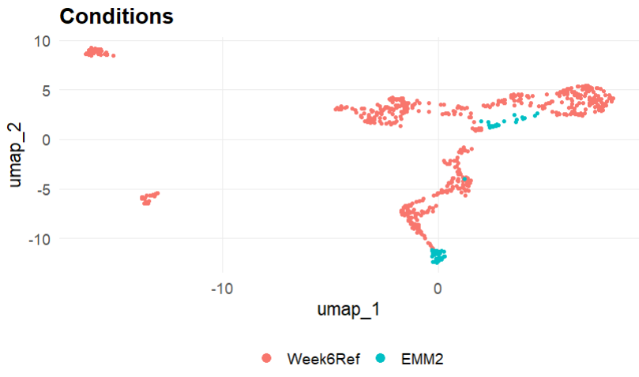
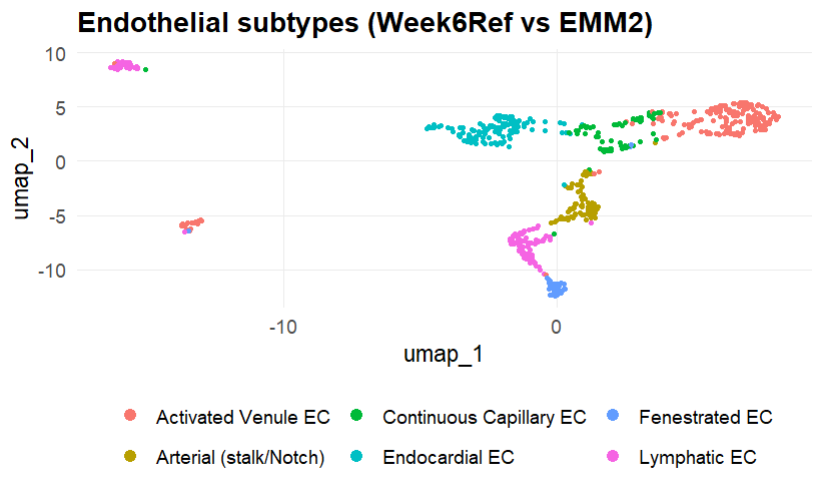
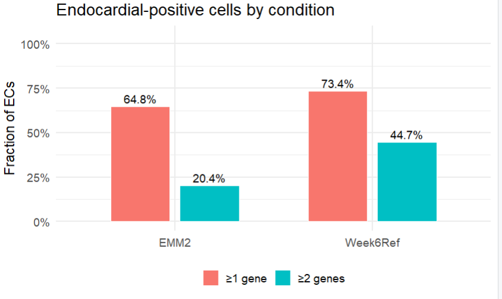
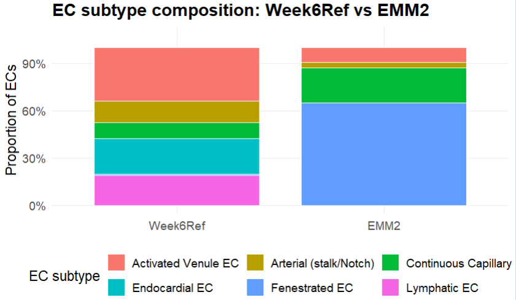

# CardiacOrganoid_scRNAseq

Independent single-cell RNA-seq analysis of human heart organoids (Aguirre lab **GSE218582**) and fetal heart reference (**GSE106118**).  
The analysis was performed independently to explore vascularization defects in engineered cardiac organoids.  

**Workflow:** QC → integration → clustering → markers → pathways → vascularization hypothesis.

---

## 📊 Workflow Diagram
*(Placeholder — add a PNG here, e.g., `results/figures/workflow.png`)*

## 🔬 Data Sources
- **Reference dataset**: GSE106118 (Week-6 fetal heart)  
- **Organoid datasets**: GSE218582 (Control, EMM1, EMM2/1, MM)  

---

## ⚙️ Quality Control
- **Week-6 reference (GSE106118)**:  
  Cells filtered on library size (`libsizes > 2000`) and dropout (`meanZero < 0.98`) → retained only high-quality cells.  

- **Organoid datasets (GSE218582)**:  
  Seurat default QC (`min.features = 200`, `min.cells = 3`) applied.  
  Endothelial identity enforced by requiring expression of ≥3 canonical EC markers (PECAM1, CDH5, KDR, VWF, etc.).  

*(QC violin plot placeholder — add figure as `results/figures/qc_violin.png`)*

---

## 📈 Results (selected figures)

- **UMAP: Endothelial Subtypes**  
  *(add `results/figures/umap_subtypes.png`)*  

- **Condition-level UMAP**  
  *(add `results/figures/umap_conditions.png`)*  

- **Subtype composition barplot**  
  *(add `results/figures/subtype_composition.png`)*  

- **Endocardial co-expression fractions**  
  *(add `results/figures/endocardial_fractions.png`)*

  ## Results

### Condition-level UMAP
UMAP of organoid and week 6 reference clusters.

### UMAP: Endothelial Subtypes
UMAP of endothelial cell subtypes between both datasets.

### Endocardial Fractions
Comparison of endocardial-positive cells between Week6 reference and EMM2 organoids.

### Endothelial Subtype Composition
Comparison of endothelial subtype composition between the week 6 referance data and the EMM2/1 organoid.

  ## 📌 Reproducibility
- R version: 4.3+  
- Key packages: `Seurat`, `Matrix`, `data.table`, `ggplot2`  
- See `results/tables/sessionInfo_ref6.txt` for full environment details.  

---

## ✨ Notes
This repository demonstrates:
1. Independent application of single-cell RNA-seq analysis.  
2. Integration of public reference + experimental datasets.  
3. Biological hypothesis generation (vascularization defects in organoids). 
